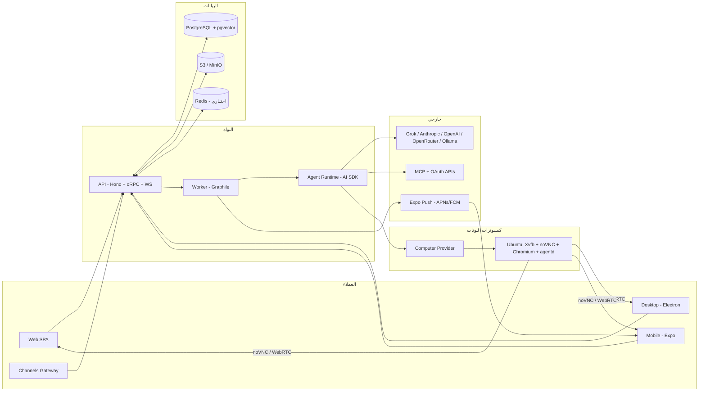
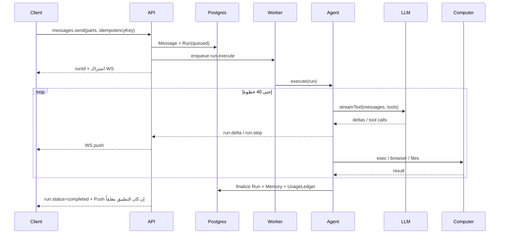

# 02 — المعمارية العامة

الغرض: وصف المكوّنات والمسارات الرئيسية وحدود الثقة وأنماط النشر.

## المكوّنات

## المبادئ

1. **Contract-first:** كل ما يعبر الشبكة له مخطط zod في `packages/contracts`.
2. **التطبيقات رفيعة والحزم سمينة:** المنطق في `domain` و`agent`.
3. **Ports & Adapters:** النموذج والكمبيوتر والموصل والتخزين والإشعار والدفع خلف واجهات.
4. **Multi-tenant:** كل صف يحمل `organizationId`؛ المستخدم الفرد منظمة شخصية.
5. **Outbox:** جدول `Outbox` مع Graphile Worker لضمان تسليم الأحداث.
6. **Idempotency** في كل أمر كتابة، لأن شبكة الموبايل غير مستقرة.
7. **أقل صلاحية:** البوتات لا ترى أسراراً خاماً والأفعال الحسّاسة تمر بالموافقات.
8. **نفس الصور** لأنماط النشر الثلاثة.

## المسار 1: رسالة ثم Run

## المسار 2: الشاشة والـ Takeover

1. العميل يطلب `computers.screen.ticket()` فتصله تذكرة قصيرة الأجل.
2. يفتح WS إلى `/ws/screen/{computerId}` فيعمل الـ API كـ proxy إلى websockify (المرحلة 2) أو WebRTC (المرحلة 4).
3. `takeover.start` يوقف الـ Run (`paused_for_takeover`) ويمرّر الإدخال للعميل.
4. `takeover.end` يستأنف الوكيل مع ملاحظة أن المستخدم تدخّل.

## المسار 3: Routine

1. Graphile Worker cron يقرأ `scheduleCron` و`timezone`، أو يُطلَق من حدث.
2. ينشئ `RoutineRun` و`Run` ضمن محادثة البوت.
3. سياسة الإشعار: `always | on_change | on_action_needed | never`.
4. يُحتفظ بآخر 20 تشغيلاً لكل Routine.

## المسار 4: ربط Connector

1. `connectors.connect(type)` يعيد URL تفويض بـ PKCE.
2. الـ callback يحفظ التوكنات مشفّرة في `Credential` (AES-256-GCM).
3. الوكيل يستدعي الموصل عبر `packages/connectors` الذي يحقن التوكن، فلا يراه النموذج.

## أنماط النشر

| النمط | المكوّنات | الجمهور |
|---|---|---|
| Mexa Cloud | VPS ثم Kubernetes، Postgres مُدار، S3، أسطول كمبيوترات | المستخدم العادي |
| Self-hosted | `docker compose up`: api وworker وweb وpostgres وredis وcaddy | شركات تشترط بقاء البيانات |
| Desktop Local | Electron يشغّل الصور محلياً عبر Docker | مطوّرون وخصوصية قصوى |

## حدود الثقة

- **المنظمة** هي حد العزل: كمبيوتر ومفاتيح وبيانات منفصلة.
- **داخل المنظمة** البوتات تشترك في الملفات والكوكيز؛ الكمبيوترات الخاصة تأتي في المرحلة 4.
- **الأسرار** تُحقن في طبقة الأدوات وتُحجب عن النموذج.
- **الشبكة:** لا وصول من الكمبيوترات للشبكة الداخلية، وسياسة egress لاحقاً.

## قرارات مفتوحة

- WebRTC منذ المرحلة 2؟ **التوصية:** noVNC أولاً، وWebRTC في المرحلة 4 ([ADR-0007](../adr/0007-docker-computers-provider-abstraction.md)).
- Redis إلزامي؟ **التوصية:** اختياري؛ نسخة API واحدة تعمل بـ in-process bus.
