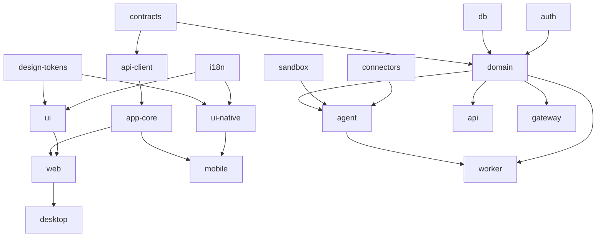

# 03 — هيكل الـ Monorepo

الغرض: توثيق الشجرة الفعلية وقواعد الاعتماد والأوامر.

## الأدوات

- pnpm workspaces مع `catalog:` لتوحيد الإصدارات، وTurborepo للمهام والكاش.
- TypeScript 5.9 مع `tsconfig.base.json` مشترك، وChangesets للإصدارات.
- ESLint (flat) وPrettier عبر `packages/config`. Vitest وPlaywright وMaestro للاختبار.

## الشجرة

```
mexa-bots/
├── apps/
│   ├── api/       Hono + oRPC + WS
│   ├── worker/    Graphile Worker: runs, routines, summaries, cleanup
│   ├── web/       React 19 + Vite (وهو renderer الديسكتوب)
│   ├── desktop/   Electron: main + preload
│   ├── mobile/    Expo: Android + iOS
│   ├── gateway/   قنوات المراسلة (المرحلة 4)
│   └── site/      الموقع التسويقي والتوثيق (Astro)
├── packages/
│   ├── contracts/ zod + oRPC types + realtime events
│   ├── domain/    منطق الأعمال
│   ├── agent/     حلقة الوكيل + الأدوات + model router + evals
│   ├── sandbox/   ComputerProvider + عميل agentd
│   ├── connectors/ MCP + OAuth + first-party
│   ├── db/        Prisma
│   ├── auth/      Better Auth
│   ├── api-client/ عميل oRPC + realtime
│   ├── app-core/  hooks + stores مشتركة
│   ├── ui/        مكوّنات الويب
│   ├── ui-native/ مكوّنات React Native
│   ├── design-tokens/
│   ├── i18n/
│   ├── config/
│   └── test-utils/
├── infra/ (compose, docker, computer-image, deploy)
├── docs/ (plan, adr, STATUS.md)
└── .github/ .changeset/ + ملفات الجذر
```

## قواعد الاعتماد



1. الحزم لا تستورد من `apps/*`.
2. `contracts` لا تعتمد إلا على `zod`، فتُستخدم بأمان في React Native.
3. `domain` لا يعرف HTTP ولا React.
4. `agent` هو الوحيد الذي يكلّم مزوّدي النماذج.
5. `sandbox` و`connectors` adapters خالصة.
6. تُفرض الحدود بـ dependency-cruiser أو eslint-plugin-boundaries في CI.

## اتفاقيات الحزم

- الاسم `@mexa/<name>`، و`"type": "module"`، و`exports` صريحة.
- في التطوير تُستهلك الحزم من `src/`، وتُبنى بـ `tsup` للنشر.
- كل حزمة فيها `README.md` و`package.json` و`tsconfig.json` و`src/index.ts` واختباراتها.
- السكربتات الموحدة: `build`, `dev`, `lint`, `typecheck`, `test`, `clean`.

## الأوامر

```bash
pnpm install
pnpm infra:up          # Postgres + Redis + MinIO + Mailpit
pnpm db:migrate
pnpm dev
pnpm --filter @mexa/mobile dev
pnpm --filter @mexa/desktop dev
pnpm lint && pnpm typecheck && pnpm test
pnpm changeset
```

المتطلبات: Node 22.12+ وpnpm 10 وDocker، وXcode 16+ لـ iOS، وAndroid Studio مع JDK 17 (أو EAS Build سحابياً).

## قرارات مفتوحة

- Remote cache: **التوصية** Vercel في البداية.
- Biome بدل ESLint وPrettier: **التوصية** إعادة النظر في المرحلة 3.
