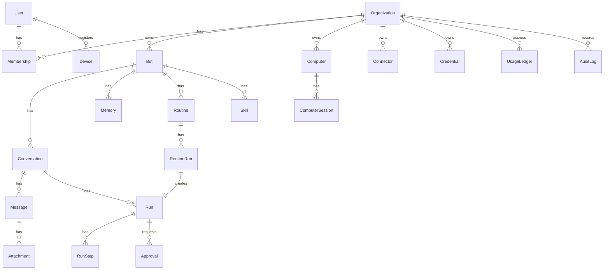

# 06 — نموذج البيانات

الغرض: تحديد كيانات PostgreSQL في `packages/db`. كل كيان tenant يحمل `organizationId`، والمعرّفات cuid2، والحذف ناعم حيث يلزم.

## مخطط الكيانات



## الكيانات

| الكيان | الحقول الأساسية |
|---|---|
| User | email, name, locale (ar/en), timezone, numeralSystem |
| Organization | name, slug, kind (personal/team), plan, settings (approvalPolicy, egressPolicy, defaultModelPreset) |
| Membership | userId, organizationId, role |
| Bot | organizationId, name, title, avatar, instructions, modelPreset, modelConfig, isPrimary, status |
| Conversation | botId, kind (direct/group/thread), parentId?, participants, lastMessageAt |
| Message | conversationId, role, authorUserId?, authorBotId?, parts (json), runId?, replyToId?, reactions |
| Attachment | messageId, storageKey, mimeType, size, sha256 |
| Run | conversationId, botId, triggerType, status, model, inputTokens, outputTokens, cachedTokens, costCents, computerSeconds, error |
| RunStep | runId, index, kind (llm/tool/approval/takeover), toolName?, input, output (مُقنَّع), durationMs |
| Memory | botId, organizationId, kind (preference/fact/summary/episode), content, embedding vector(1536), source, importance |
| Routine | botId, name, instructions, scheduleCron?, timezone, triggerType, notifyPolicy, onMissingSources, onNoChange, enabled, nextRunAt |
| RoutineRun | routineId, runId, status, summary, changed |
| Skill | botId, name, description, steps, createdFromRunId? |
| Computer | organizationId, kind (team/private), botId?, provider, providerRef, status, image, resources, lastActiveAt |
| ComputerSession | computerId, userId?, runId?, kind (view/takeover), startedAt, endedAt |
| Connector | organizationId, type, accountLabel, config, credentialId, status |
| Credential | organizationId, kind, ciphertext, iv, keyVersion, expiresAt? |
| Approval | runId, kind (send/payment/delete/publish/custom), payloadPreview, status, decidedById? |
| Device | userId, platform, pushToken, appVersion |
| Notification | userId, kind, title, body, data, readAt? |
| UsageLedger | organizationId, period, botId?, runId?, metric, quantity, costCents |
| Subscription | organizationId, provider (stripe/revenuecat), plan, status, currentPeriodEnd |
| AuditLog | organizationId, actorUserId?, actorBotId?, action, targetType, targetId, metadata, ip |
| Outbox | eventType, payload, status, attempts, availableAt |

## مقتطف Prisma

```prisma
model Bot {
  id             String      @id @default(cuid())
  organizationId String
  name           String
  title          String?
  instructions   String
  modelPreset    ModelPreset @default(balanced)
  isPrimary      Boolean     @default(false)
  createdAt      DateTime    @default(now())
  updatedAt      DateTime    @updatedAt
  deletedAt      DateTime?
  organization   Organization @relation(fields: [organizationId], references: [id])
  @@index([organizationId])
}

model Memory {
  id        String @id @default(cuid())
  botId     String
  kind      MemoryKind
  content   String
  embedding Unsupported("vector(1536)")?
  bot       Bot @relation(fields: [botId], references: [id], onDelete: Cascade)
  @@index([botId, kind])
}
```

## الاحتفاظ والفهارس

- `RunStep.output` يُقنَّع من الأسرار ويُقصّ إلى 64KB، والكامل في S3.
- آخر 20 `RoutineRun` لكل Routine. لقطات الشاشة 30 يوماً وسجلات الوصول 90 يوماً.
- حذف الحساب: ناعم فوراً ثم صلب بعد 30 يوماً مع حجم الكمبيوتر.
- فهارس: `Message(conversationId, createdAt)` بـ cursor، وHNSW على `Memory.embedding`، و`Routine(nextRunAt)` للمفعّلة.
- Row-Level Security كطبقة دفاع ثانية في المرحلة 5.

## قرارات مفتوحة

- Partitioning لجدول Message بعد 50M صف: **التوصية** عند الحاجة.
- `parts` كـ JSON بمخطط zod صارم بدل جداول فرعية: **التوصية** JSON.
